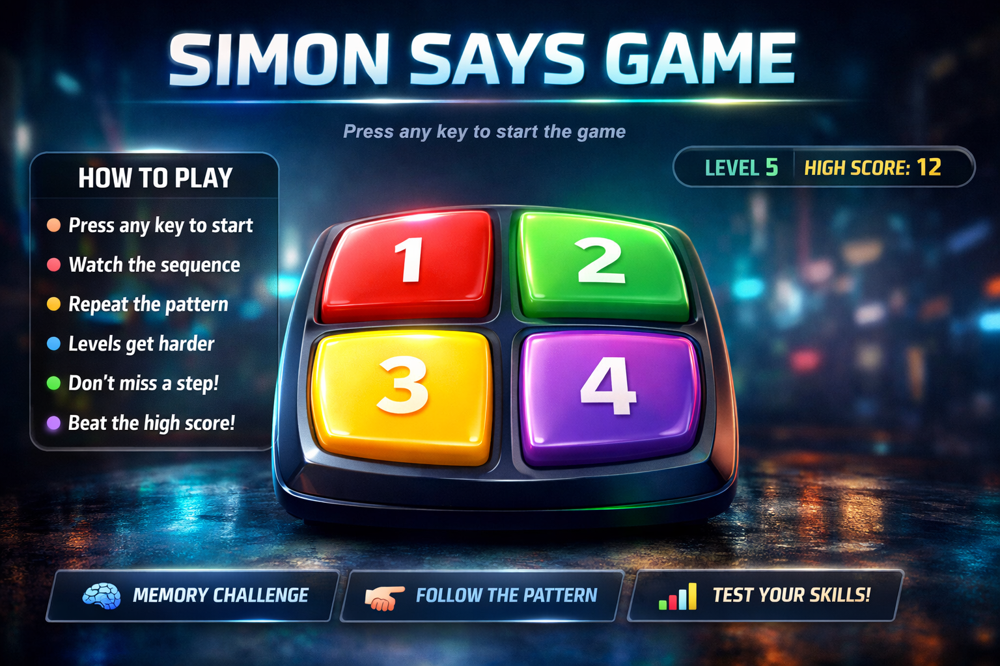

# 🎮 Simon Says Game

A fun and interactive memory game built using **HTML, CSS, and JavaScript**.  
Test your memory skills by repeating the sequence of colors shown on the screen. Each level adds a new step to the pattern!

---

## 🌟 Live Demo
Live Demo 👉 https://chaitanya-295.github.io/Simon-Says-Game/

---

## 📸 Preview
## Preview

---

## 🚀 Features

- 🎯 Random color sequence generation  
- 📈 Level progression system  
- 🧠 Memory challenge gameplay  
- 🏆 Highest score tracking using LocalStorage  
- ✨ Smooth animations and effects  
- 📱 Fully responsive design  

---

## 🕹️ How to Play

1. Press any key to start the game.  
2. Watch the color pattern carefully.  
3. Repeat the pattern by clicking the buttons.  
4. Each level adds one more color to the sequence.  
5. If you click the wrong button → Game Over.  
6. Try to beat your highest score!  

---

## 🛠️ Built With

- HTML5  
- CSS3  
- JavaScript (Vanilla JS)  

---

## 📂 Project Structure
Simon-Says-Game

│── index.html

│── style.css

│── app1.js

│── README.md

---

## 📌 Future Improvements

- 🔊 Sound effects  
- 🎨 Theme switcher  
- 🏆 Leaderboard system  
- 🎮 Difficulty levels  
- ⏱ Timer mode  

---

## 👨‍💻 Author

**Chaitanya Kamble**

---

## ⭐ Show Your Support

If you like this project, give it a ⭐ on GitHub!
